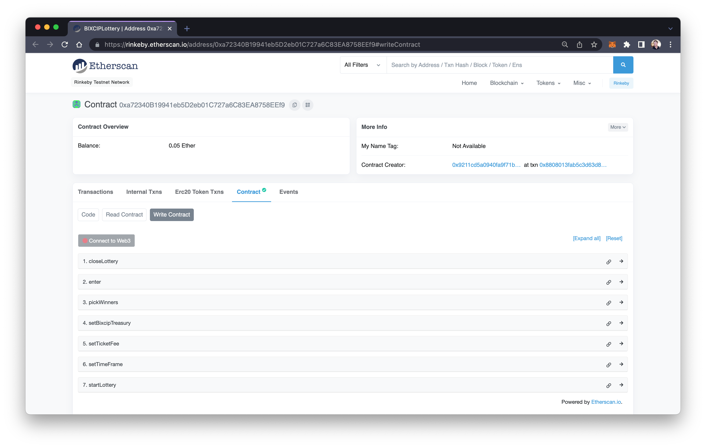
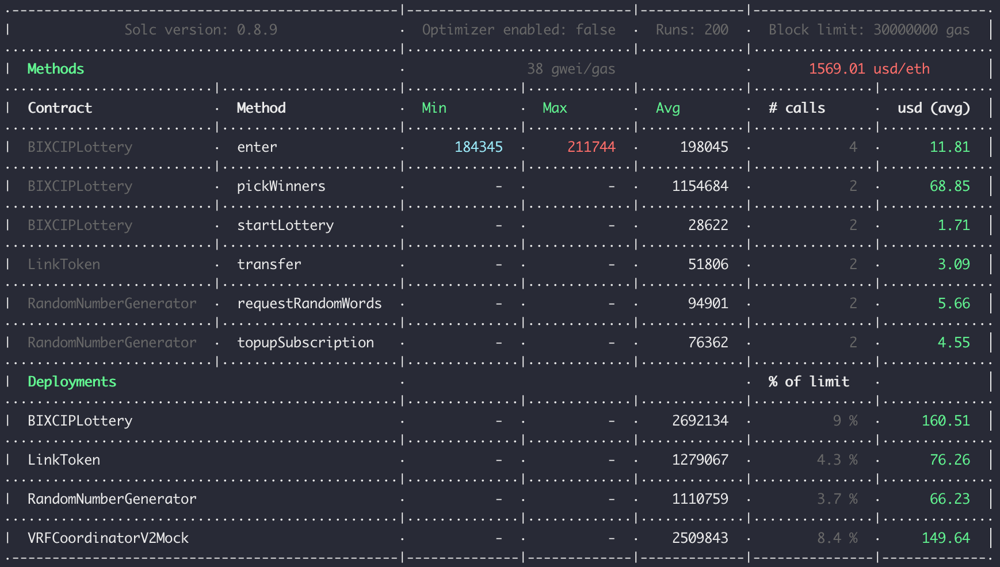
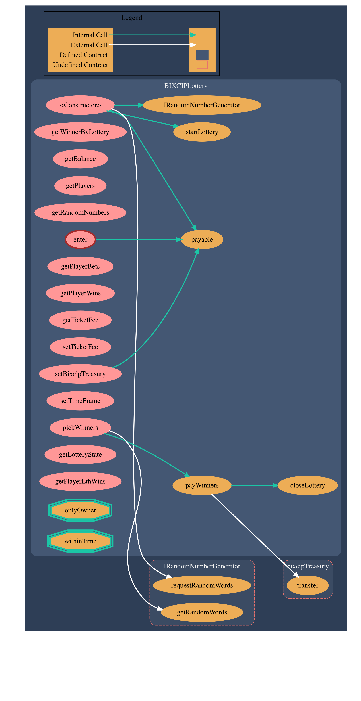

# BIXCIP Lottery

This repository smart contracts (contracts) and decentralized application (DApp) for the BIXCIP lottery.

## Overview

The contracts are stored here: `/contracts`

The DApp is stored here: `/lottery-dapp`

The lottery is deployed on Ethereum Goerli (TestNet) here: [0xD01c6E8E118F02a22a509Cd6B70622CD43b7CD33](https://goerli.etherscan.io/address/0xD01c6E8E118F02a22a509Cd6B70622CD43b7CD33#code)

## Requirements

To run the project you need:

- [Node.js](https://nodejs.org) development environment.
- [Truffle](https://www.trufflesuite.com/truffle) for compiling, deploying(installed globally via npm).
- [Hardhat](https://hardhat.org/) for testing.

- A file named `.env` in the root folder.

Your `.env` file must contain the following:
- Your [Etherscan API key](https://etherscan.io/myapikey) or [Polygonscan API Key](https://polygonscan.com/myapikey) for verification the source code:

  `ETHERSCAN_API_KEY='api key'` or 
  `POLYGONSCAN_API_KEY='api key'`

Your `.env` file may optionally contain the following:
- Your [Alchemy](https://dashboard.alchemyapi.io/) project Keys for deploying to Ethereum Goerli and or (optional) Mumbai networks:

  `ALCHEMY_GOERLI_KEY='___your_key___'` or 
  `ALCHEMY_MUMBAI_KEY='___your_key___'`

- 2 Private Keys:
   `PRIVATE_KEY=0x___yourkey___`
   `PRIVATE_KEY2=0x___yourkey___`

- Coin market cap api key for converting eth to usd in the test gas report:
   `GAS_REPORTER_COIN_MARKET_CAP_API_KEY=`

## Tasks before usage

Pull the repository from GitHub, then install its dependencies by executing this command:

```bash
$ npm install
```

or 

```bash
$ yarn install
```

or 

```bash
$ pnpm install
```

## Testing

Hardhat was used to test the project.

Start by testing locally. It produces the fastest result. 

Run the following in the terminal:

```shell
$ npx hardhat test
```

or

```shell
$ yarn hardhat test
```

or

```shell
$ pnpm hardhat test
```

Next, test the code on a network. If you haven't stored your private keys in a `.env` file, you can use `truffle dashboard`. Ensure dashboard is connected to `Goerli` network.

```shell
$ truffle dashboard (in one terminal)
$ npx hardhat test --network truffle-dashboard (in another terminal)
```

If you had stored private keys in a `.env` file, you can use the following networks: 
mumbai, tBNB, goerli.

```shell
$ npx hardhat test --network [network-name]
```

> **Note**: Whichever network you decide to use, ensure you have sufficient crypto in that network and also sufficient Link tokens. You can fetch both from this [Faucet](https://faucets.chain.link/).

## Deployment

Truffle was used for deployment.

To deploy the smart contracts to a network, replace _[networkName]_ in this command:

```bash
$ truffle migrate --network [networkName]
```

Networks can be configured in _truffle-config.js_. We've preconfigured the following:

- `dashboard` (for testing through truffle dashboard)
Note that truffle dashboard has been set up to use the goerli network.

### Note

The above procedure deploys all the contracts. If you want to deploy only specific contracts, you can run only the relevant script(s) via the below command:

```bash
$ truffle migrate -f [start] --to [end] --network [name]
```

Replace _[start]_ with the number of the first and _[end]_ with the number of the last migration script you wish to run. To run only one script, _[start]_ and _[end]_ should match. The numbers of the scripts are:

- 1 Migrations
- 2 Random Number Generator
- 3 BIXCIP Lottery
- 4 LinkToken

If the script fails before starting the deployment, you might need to run the first one, too.

## Verification

For automatic verification of the source code on Etherscan you can use [truffle plugin verify](https://github.com/rkalis/truffle-plugin-verify):

```bash
$ truffle run verify [contractName] --network [networkName]
```

## Admin Controlled Lottery Operations

BIXCIP contract owner (BIXCIP admin) and BIXCIP Treasury (BIXCIP team) has access to `onlyAdmin` functions or operations.



After verifying the source code on etherscan, you can use it to perform the following priviledged operations:

- setTicketFee (integer) [default: 0.01 ether]
- setBixcipTreasury (address)
- setTimeFrame (integer)
- pickWinners
- startLottery
- closeLottery
- payWinners (automatically triggered after pickWinners function)

## Smart Contracts

### RandomNumberGenerator.sol
This smart contract generates random numbers using Chainlink. It generates 3 random numbers as specified in `numWords` attribute.
`requestRandomWords` generates the random numbers and `getRandomWords` fetches the random numbers from the contract.

### BIXCIPLottery.sol
This smart contract obtains random numbers from `RandomNumberGenerator.sol`. It then uses these random numbers to generate 3 random winners. It picks the winner from the players who enter the lottery. It distributes to the players all the money that was in the lottery.

## Gas Reports

Run gas report using Truffle Dashboard:

```shell
$ yarn test-gas --network truffle-dashboard
```

or

```shell
$ npm run test-gas --network truffle-dashboard
```

or

```shell
$ pnpm run test-gas --network truffle-dashboard
```

Response:

```shell
> bixcip-contracts@1.0.0 test-gas /Users/skurilyak/dev/phoenixteam/bixcip/bixcip-lottery
> REPORT_GAS=1 hardhat test


  End to End Lottery Smart Contracts Test
Network name:  hardhat
Duplicate definition of Transfer (Transfer(address,address,uint256,bytes), Transfer(address,address,uint256))
Link Token address:  0xe7f1725E7734CE288F8367e1Bb143E90bb3F0512
Investors:  [
  '0xf39Fd6e51aad88F6F4ce6aB8827279cffFb92266',
  '0x70997970C51812dc3A010C7d01b50e0d17dc79C8'
]
Contract balance:  BigNumber { value: "10000000000000000000" }
    ✓ Should have 1 link
Subscription balance:  BigNumber { value: "10000000000000000000" }
    ✓ Should send 10 link to the VRF Coordinator
SubscriptionId:  BigNumber { value: "1" }
    ✓ Should generate a subscription id
Waiting for time to pass
Random Number Array:  [
  BigNumber { value: "77676537065960878698898692042018114106337750925255485067533933387271373890921" },
  BigNumber { value: "98521912898304110675870976153671229506380941016514884467413255631823579132687" },
  BigNumber { value: "46856049987324987851654180578118835177937932377897439695260177228387632849548" }
]
    ✓ Should generate 3 random numbers on request
ticket fee:  BigNumber { value: "10000000000000000" }
final fee BigNumber { value: "30000000000000000" }
[
  '0xf39Fd6e51aad88F6F4ce6aB8827279cffFb92266',
  '0xf39Fd6e51aad88F6F4ce6aB8827279cffFb92266',
  '0xf39Fd6e51aad88F6F4ce6aB8827279cffFb92266'
]
contract balance:  BigNumber { value: "30000000000000000" }
    ✓ should allow entrance after ether ticket fee has been deposited
current bets:  [
  BigNumber { value: "3" },
  BigNumber { value: "2" },
  BigNumber { value: "1" }
]
new bets [
  BigNumber { value: "3" },
  BigNumber { value: "2" },
  BigNumber { value: "1" },
  BigNumber { value: "6" },
  BigNumber { value: "5" },
  BigNumber { value: "4" }
]
    ✓ should append new bets after previous ones have been made
timestamp:  BigNumber { value: "1661537152" }
timeframe:  BigNumber { value: "2592000" }
    ✓ should have a time frame
initial lottery balance:  BigNumber { value: "60000000000000000" }
treasury balance:  BigNumber { value: "43740000000000000" }
player eth wins:  BigNumber { value: "16260000000000000" }
BigNumber { value: "16260000000000000" }
    ✓ Should pay the winners 30% and the bixcip treasury 70% as well
previous wins:  [
  BigNumber { value: "3" }, BigNumber { value: "2" },
  BigNumber { value: "1" }, BigNumber { value: "6" },
  BigNumber { value: "5" }, BigNumber { value: "4" },
  BigNumber { value: "3" }, BigNumber { value: "2" },
  BigNumber { value: "1" }, BigNumber { value: "6" },
  BigNumber { value: "5" }, BigNumber { value: "4" },
  BigNumber { value: "3" }, BigNumber { value: "2" },
  BigNumber { value: "1" }, BigNumber { value: "6" },
  BigNumber { value: "5" }, BigNumber { value: "4" },
  BigNumber { value: "3" }, BigNumber { value: "2" },
  BigNumber { value: "1" }, BigNumber { value: "6" },
  BigNumber { value: "5" }, BigNumber { value: "4" }
]
    ✓ should append new wins
1
0
    ✓ Should set the correct enum state

  10 passing (4s)
```



## Function Call Graph

Visualize functions and function calls in `BIXCIPLottery.sol`:

```shell
$ surya graph contracts/BIXCIPLottery.sol | dot -Tpng > BIXCIPLottery.png
```

Response:



## Function Description

Describe all functions in `BIXCIPLottery.sol`:

```shell
$ surya describe contracts/BIXCIPLottery.sol
```

Response:

```shell
+  BIXCIPLottery
    - [Pub] <Constructor> #
    - [Pub] getWinnerByLottery
    - [Pub] getBalance
    - [Pub] getPlayers
    - [Pub] getRandomNumbers
    - [Pub] enter ($)
       - modifiers: withinTime
    - [Pub] getPlayerBets
    - [Pub] getPlayerWins
    - [Pub] getTicketFee
    - [Pub] setTicketFee #
       - modifiers: onlyOwner
    - [Pub] setBixcipTreasury #
       - modifiers: onlyOwner
    - [Pub] setTimeFrame #
       - modifiers: onlyOwner
    - [Pub] pickWinners #
       - modifiers: onlyOwner
    - [Int] payWinners #
    - [Pub] startLottery #
       - modifiers: onlyOwner
    - [Pub] closeLottery #
       - modifiers: onlyOwner
    - [Pub] getLotteryState
    - [Pub] getPlayerEthWins


 ($) = payable function
 # = non-constant function
```

## Docs

Looking for additional documentation for Solidity API? Visit: 

[docs/index.md](docs/index.md)